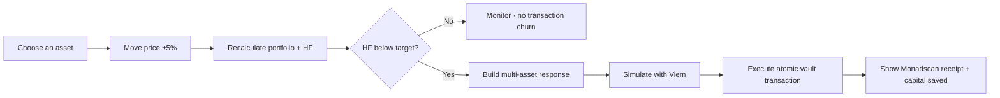

<p align="center">
  
</p>

<h1 align="center">SLI/CER</h1>

<p align="center">
  <strong>Autonomous health-factor protection and yield routing for Aave on Monad.</strong><br />
  Keep the yield. Cut the liquidation risk. Prove every response onchain.
</p>

## The pitch

Leveraged DeFi positions are efficient—until the market moves. A falling collateral price can turn a high-yield strategy into a liquidation race, while manually unwinding a multi-asset position is slow, fragmented, and stressful.

**Slicer turns that emergency into an automatic portfolio response.** It watches health factor, finds a diversified top-N supply and borrow strategy, and executes the exact asset-level actions needed to restore the vault when risk crosses the target. When the position gets healthier, Slicer stays out of the way.

## Why Slicer

- **Health-factor automation** — the vault acts only when HF falls below target, avoiding unnecessary churn in healthy markets.
- **Diversified yield routing** — supply and borrow baskets are ranked by APY, value locked, liquidity, and HF contribution, then concentration-capped.
- **Atomic asset-level execution** — one vault transaction can `SUPPLY`, `WITHDRAW`, `BORROW`, and `REPAY` multiple assets.
- **Live onchain replay** — every ±5% price tick submits a real Monad testnet transaction through Viem and links the confirmed receipt on Monadscan.
- **Capital impact, not abstract metrics** — the Live Lab shows total simulated asset value after every tick for Slicer, an all-in-yield strategy, and a do-nothing position.
- **Permanent liquidation semantics** — once a simulated strategy is liquidated, a later price recovery does not bring it back.
- **Telegram rescue reports** — every ten ticks, Slicer reports the cumulative dollars and percentage of vault value protected when it beats the do-nothing benchmark.

## Demo flow



Open **Live Lab**, select the supplied asset to shock, and advance the trajectory. Each timestamp shows:

- the new oracle price and pre-response HF;
- Slicer’s total asset value and cumulative change;
- the latest supply and borrow distribution;
- every asset, action type, token amount, and Monadscan link;
- a live comparison against **All-In Yield** and **Do Nothing**.

## Live Monad testnet proof

| Component | Deployment |
|---|---|
| Managed vault | [`0x485C…5e9F`](https://testnet.monadscan.com/address/0x485C3C1a28ad9848939265df2Fba5Bdef7e15e9F#code) |
| Aave-compatible pool | [`0x25e0…d97d`](https://testnet.monadscan.com/address/0x25e0Fbd049e680D72C42128eFc85d9F7edD5d97d#code) |
| Latest six-action rebalance | [`0x1ee5…5a98`](https://testnet.monadscan.com/tx/0x1ee5dd68320ac779a5ce68a491702d6b6fc3c876e7f04bcb845b9cc05c945a98) |

The vault, pool, and five demo ERC-20 assets are all **Exact Match** verified on Monadscan. Full addresses and deployment receipts live in [`deployments/monad-testnet.demo.json`](deployments/monad-testnet.demo.json).

## Architecture

| Layer | Technology | Responsibility |
|---|---|---|
| Strategy | Browser-native optimizer | Top-N market selection, HF response, benchmark trajectories |
| Execution | `ManagedAaveVault.sol` | Atomic multi-asset action basket with an asymmetric HF gate |
| Chain interaction | Viem + server-side signer | Preflight simulation, broadcast, confirmation, explorer receipts |
| Contracts | Foundry | Deployment, unit tests, Monad testnet scripts |
| Alerts | Telegram Bot API | Ten-tick cumulative protection reports |

There is no separate keeper demo and no simulated transaction hash: the web app owns the full interaction loop while the private key remains server-side in gitignored `.env.local`.

## Run locally

Requirements: Node.js 22+, npm, and Foundry.

```bash
npm install
cp .env.example .env.local
npm run dev
```

Configure the Monad testnet private key and deployed addresses in `.env.local`, then open:

```text
http://127.0.0.1:4174
```

Optional Telegram alerts use `TELEGRAM_BOT_TOKEN` and `TELEGRAM_CHAT_ID` in the same local environment file.

## Deploy and verify

Deploy a fresh demo system:

```bash
npm run deploy:testnet-demo
```

Run the complete validation suite:

```bash
npm run typecheck
npm run test:telegram
forge fmt --check
forge test -vvv
```

## Hackathon scope

The deployed pool is an Aave-compatible Monad testnet harness that makes repeatable oracle trajectories possible during the demo. Vault execution, ERC-20 movements, HF enforcement, transaction receipts, explorer links, and Telegram delivery are real. Pointing the same vault interaction layer at the target Aave deployment is the next integration step. The contracts are hackathon software and are not audited for production deposits.
